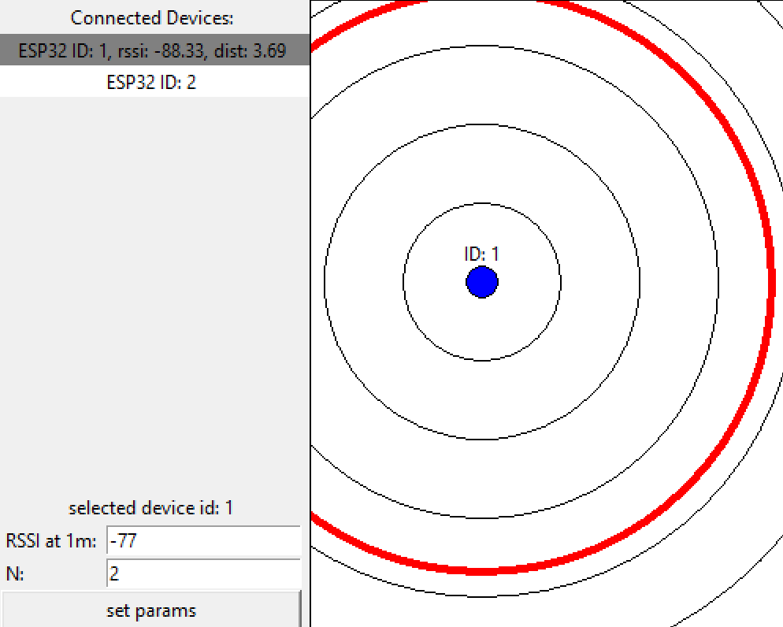
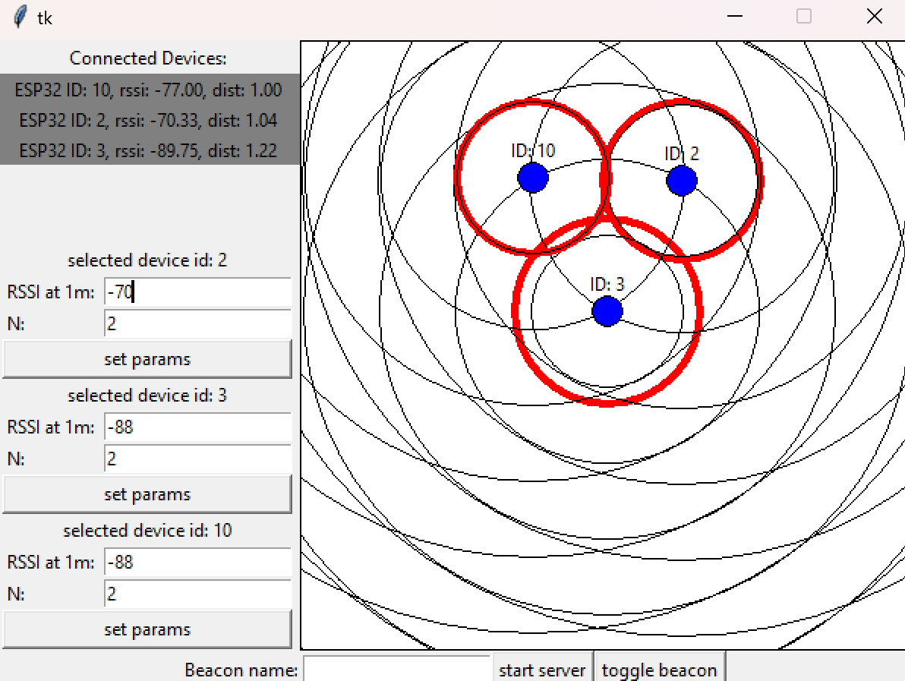
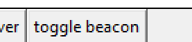
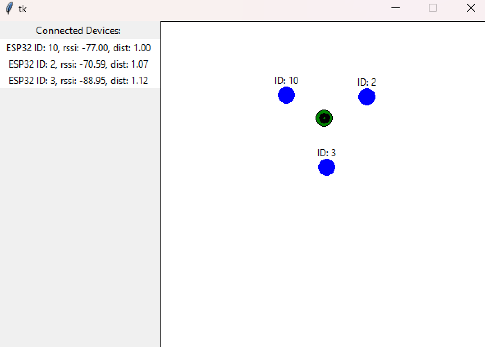

# BT-Tracer
System for Tracking the Location of Bluetooth Low Energy (BLE) Beacons Using ESP32.

## About

Tracking the location of objects in a confined and small area, such as a room or building (IPS - Indoor Positioning System), has many applications in industry and Smart Home solutions. In this case, using GPS is not effective due to the limitations of this technology. Indoor positioning systems typically rely on other technologies based on popular standards such as Wi-Fi, RFID, UWB, or BLE, utilizing signal strength analysis recorded by a receiver (RSSI).

BLE (Bluetooth Low Energy) is an extension of the classic Bluetooth standard, designed to reduce power consumption while maintaining a similar range to the standard version. Due to its low energy consumption, BLE technology is often used in IPS systems (e.g., iBeacon).

Tracking the location of a BLE beacon is possible by analyzing the signal strength emitted by a device that broadcasts at regular intervals using the BLE protocol. Based on the RSSI values received by receivers placed in different locations within the tracking area, it is possible to determine the distance from each receiver to the beacon and then estimate the beacon's approximate location using the trilateration method.
 

## Used Devices

- **ESP32 with ESP-WROOM-32** – serving as the BLE beacon (any device supporting BLE, which can be identified based on the announced name, can perform the role of the beacon).

- **ESP32 with ESP-WROOM-32 x3 (or more)** – serving as receivers that read the RSSI value from the broadcasting beacon.

- **PC with Windows 11** – running the server and communicating with the receivers. It must be on the same VLAN as the receivers.

## System Components and Schema

### Server
The server application, upon launch, provides the user with a graphical interface that allows for configuration and visualization of the positions of receivers and the tracked beacon. Once the server is running, it starts listening for connections from receivers. Communication between the receivers and the server occurs via the TCP protocol.

### Receivers
Once the ESP32 receiver is powered on, it attempts to connect to the network. It then initializes the BLE module and tries to establish communication with the server. If the server is running, the connection is initialized, and the server sends the necessary configuration to the receiver for tracking the beacon (the name of the announced device). The receiver then regularly scans for BLE devices, and if it detects the tracked device, it sends the current RSSI to the server.

<p align="center">
  
</p>

### RSSI Error Reduction
The RSSI value read directly by the ESP32 is susceptible to noise and interference depending on the environment where the tests are conducted. Due to measurement errors, the values can significantly vary between successive readings, making it difficult to accurately determine the beacon's location. To reduce the impact of measurement errors, a Kalman filter was applied. The Kalman filter is a widely used state estimator that estimates the value of a variable based on noisy readings, taking into account previous values and thus reducing the error. (Application of the Kalman filter for RSSI: [https://www.wouterbulten.nl/posts/kalman-filters-explained-removing-noise-from-rssi-signals/](https://www.wouterbulten.nl/posts/kalman-filters-explained-removing-noise-from-rssi-signals/)).

### Beacon Position Calculation
Calculating the approximate location of the beacon based on three or more measurements (from each receiver) is possible using the trilateration method ([https://www.alanzucconi.com/2017/03/13/positioning-and-trilateration/](https://www.alanzucconi.com/2017/03/13/positioning-and-trilateration/)). Trilateration allows for determining the intersection point of three or more circles (the receiver as the center of the circle, the radius as the measured distance) or finding an approximation if, due to measurement errors, the circles do not intersect. (Used library: [https://pypi.org/project/easy-trilateration/](https://pypi.org/project/easy-trilateration/)).


## Code fragments


#### BLE Initialization

```
void init_ble_scanner() {
  BLEDevice::init("");
  pBLEScan = BLEDevice::getScan(); 
  pBLEScan->setAdvertisedDeviceCallbacks(new MyAdvertisedDeviceCallbacks(), true);
  pBLEScan->setActiveScan(true);
  pBLEScan->setInterval(100);
  pBLEScan->setWindow(99);
}
```

#### Connecting to server
```
bool initialize_conn_to_server() {
    Message msg;
    int res;

    if (!client.connect(host, port)) {
      Serial.printf("Could not connect to the hostname %s on port %d \n", host, port);
      return false;
    }

    msg.type = 1; 
    client.write((uint8_t*)&msg, sizeof(Message));
    int start = millis();
    MessageWithName msgName;
    while (client.available() < sizeof(MessageWithName)) {
      if (millis() - start > 1000) {
        Serial.printf("Timout on ACK from server \n");
        return false;
      }
    }

    res = client.read((uint8_t*)&msgName, sizeof(MessageWithName));
    Serial.printf("GOT BEACON NAME: %s\n", msgName.beacon_name);
    beacon_name = msgName.beacon_name;
    return true;
}

```

#### Reading RSSI
```
class MyAdvertisedDeviceCallbacks: public BLEAdvertisedDeviceCallbacks {
    void onResult(BLEAdvertisedDevice advertisedDevice) {
      if (advertisedDevice.getName() == beacon_name) {
        Serial.printf("Advertised Device: %s \n", advertisedDevice.toString().c_str());
        rssi_to_send = advertisedDevice.getRSSI();
        pBLEScan->stop();
      }
    }
};
```

## Usage

1. Run server app:
    ```
    $ python ./server/main.py
    ```
2. Set the beacon name and start the server:

<p align="center">
  
</p>

 - The name must match the one broadcasted by the beacon.

3. Configure receivers:

<p align="center">
  
</p>

- The successive black circle radii represent a distance of 1m.
- The red circle represents the measured distance from the beacon.
- Adjust the parameters (RSSI at 1m and N) for each receiver so that for a beacon located 1m away from the receiver, the red circle overlaps with the smallest black circle.

Example setup for 3 receivers arranged in a triangle with 2m sides:

<p align="center">
  
</p>

4. Display beacon location:

<p align="center">
  
</p>

The green marker marks the location of the beacon.

<p align="center">
  
</p>

